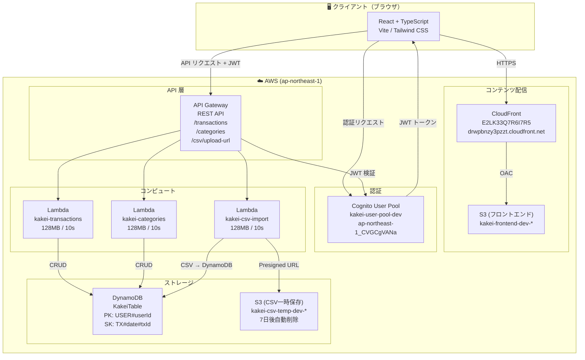
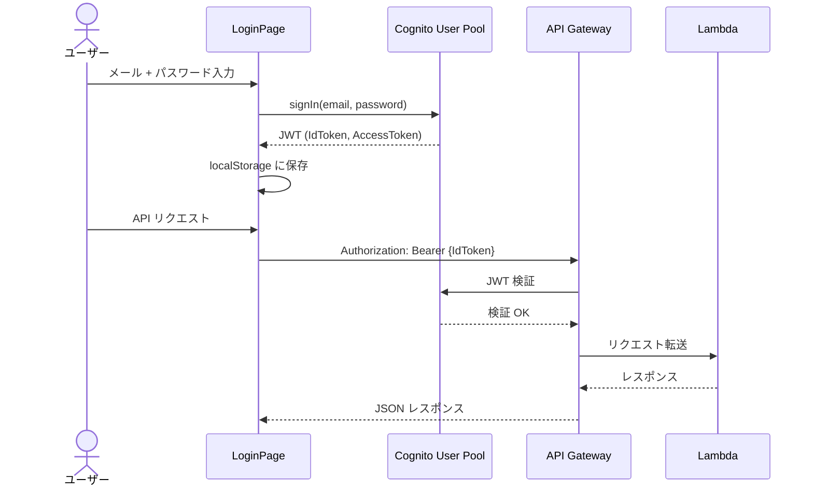
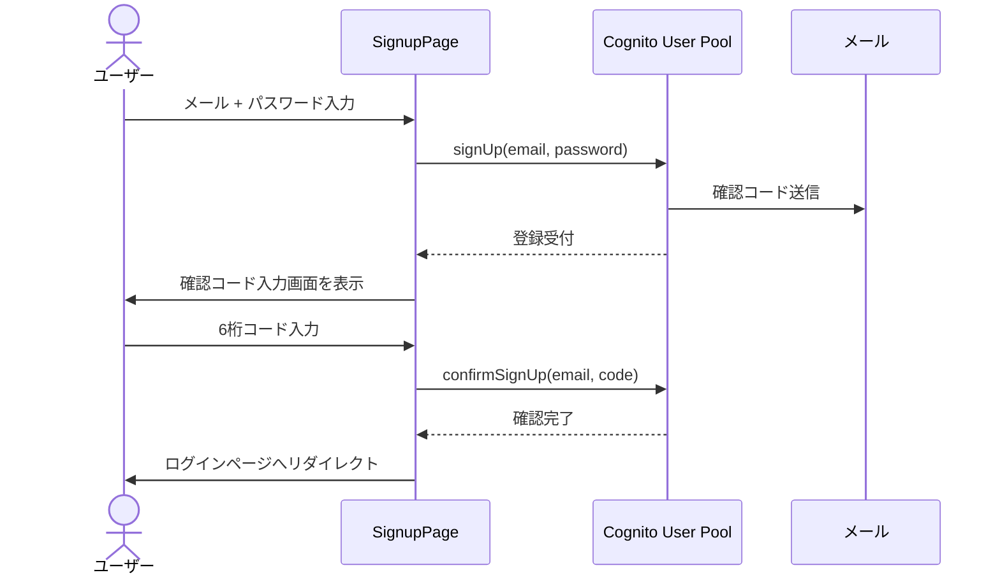
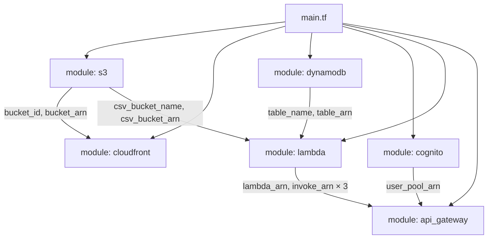
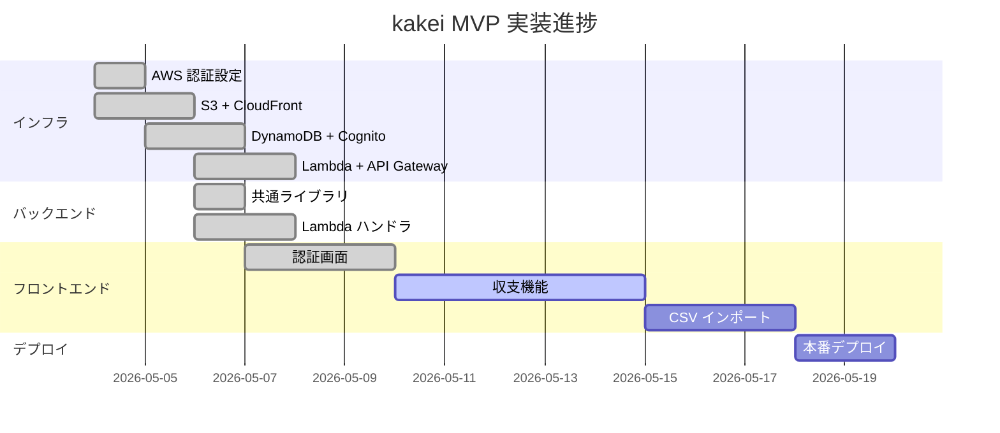

# kakei アーキテクチャ図

> Diagram-as-code: Mermaid で記述。GitHub / VS Code の Markdown プレビューで図として表示されます。

---

## 全体アーキテクチャ



---

## 認証フロー



---

## サインアップフロー



---

## DynamoDB データモデル

```mermaid
erDiagram
    KakeiTable {
        string PK "USER#userId"
        string SK "TX#date#txId または CAT#categoryId"
        string type "income / expense"
        number amount "金額"
        string category "カテゴリ"
        string date "日付 (YYYY-MM-DD)"
        string memo "メモ (optional)"
        string createdAt "作成日時"
        string updatedAt "更新日時"
    }
```

---

## Terraform モジュール構成



---

## 進捗状況


