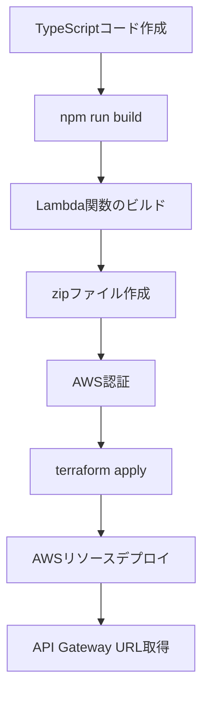

# デプロイ手順とコマンド解説

**作成日**: 2026年5月26日  
**対象**: kakei（家計管理アプリ）のバックエンドデプロイ

---

## 📋 目次

1. [デプロイの全体像](#デプロイの全体像)
2. [使用したコマンド一覧](#使用したコマンド一覧)
3. [各コマンドの詳細解説](#各コマンドの詳細解説)
4. [デプロイされたリソース](#デプロイされたリソース)
5. [トラブルシューティング](#トラブルシューティング)

---

## デプロイの全体像

### デプロイフロー



### 今回デプロイしたもの

1. **バックエンドコード**: TypeScript → JavaScript（ES Module形式）
2. **Lambda関数**: 3つの関数（transactions, categories, csv-import）
3. **API Gateway**: RESTful API エンドポイント
4. **CORS設定**: フロントエンドからのアクセスを許可

---

## 使用したコマンド一覧

### 1. バックエンドのビルド

```bash
cd backend
npm run build
```

### 2. Lambda関数のzipファイル作成

```powershell
Compress-Archive -Path dist\* -DestinationPath lambda-functions.zip -Force
```

### 3. AWS認証（SSOログイン）

```bash
aws sso login --profile dev
```

### 4. Terraformでデプロイ

```bash
cd terraform
terraform apply -auto-approve
```

---

## 各コマンドの詳細解説

### 1. `npm run build` - TypeScriptのビルド

#### 何をしているか？

TypeScriptで書かれたLambda関数のコードを、AWSで実行できるJavaScriptに変換（トランスパイル）します。

#### 実行内容

```bash
esbuild src/**/*.ts --bundle --platform=node --target=node20 --outdir=dist --format=esm
```

#### オプションの意味

| オプション | 意味 | 理由 |
|-----------|------|------|
| `src/**/*.ts` | すべての`.ts`ファイルを対象 | バックエンドのすべてのコードをビルド |
| `--bundle` | 依存関係を1つのファイルにまとめる | Lambda関数は単一ファイルで動作させる |
| `--platform=node` | Node.js環境向けにビルド | Lambda関数はNode.jsで実行される |
| `--target=node20` | Node.js 20向けに最適化 | AWSのLambda実行環境に合わせる |
| `--outdir=dist` | 出力先を`dist/`フォルダに | ビルド成果物を整理 |
| `--format=esm` | ES Module形式で出力 | モダンなJavaScript形式 |

#### 出力結果

```
dist/
├── handlers/
│   ├── transactions.js  (1.3MB)
│   ├── categories.js    (1.3MB)
│   └── csv-import.js    (1.7MB)
├── lib/
│   ├── dynamo.js        (1.3MB)
│   ├── response.js      (661B)
│   └── auth.js          (314B)
└── types/
    └── index.js
```

#### なぜこのサイズ？

- AWS SDKなどの依存関係がすべて含まれているため
- 実際にはLambda実行時に圧縮・最適化される

---

### 2. `Compress-Archive` - zipファイル作成

#### 何をしているか？

ビルドしたJavaScriptファイルをzipファイルにまとめます。Lambda関数はzipファイルとしてアップロードする必要があります。

#### コマンド詳細

```powershell
Compress-Archive -Path dist\* -DestinationPath lambda-functions.zip -Force
```

#### オプションの意味

| オプション | 意味 |
|-----------|------|
| `-Path dist\*` | `dist`フォルダ内のすべてのファイルを対象 |
| `-DestinationPath lambda-functions.zip` | 出力ファイル名 |
| `-Force` | 既存のzipファイルがあれば上書き |

#### 作成されるファイル

```
backend/lambda-functions.zip (約1.7MB)
```

#### なぜzipファイルが必要？

- AWS Lambdaはzipファイルまたはコンテナイメージでデプロイする
- 今回はzipファイル方式を採用（シンプルで低コスト）

---

### 3. `aws sso login` - AWS認証

#### 何をしているか？

AWS SSOを使って、AWSアカウントに安全にログインします。

#### コマンド詳細

```bash
aws sso login --profile dev
```

#### オプションの意味

| オプション | 意味 |
|-----------|------|
| `--profile dev` | `dev`という名前のプロファイルを使用 |

#### 実行の流れ

1. **ブラウザが自動で開く**
   ```
   https://oidc.ap-northeast-1.amazonaws.com/authorize?...
   ```

2. **AWS SSOログイン画面が表示される**
   - メールアドレスとパスワードを入力
   - MFA（多要素認証）がある場合は認証コードを入力

3. **認証成功**
   ```
   Successfully logged into Start URL: https://d-956793c515.awsapps.com/start
   ```

4. **認証情報が保存される**
   - 場所: `~/.aws/sso/cache/`
   - 有効期限: 通常8時間

#### なぜSSOが必要？

- **セキュリティ**: アクセスキーをローカルに保存しない
- **一元管理**: 複数のAWSアカウントを1つのログインで管理
- **自動更新**: トークンが自動で更新される

#### 認証エラーが出た場合

```
Error: failed to refresh cached credentials
```

→ トークンの有効期限が切れているので、再度`aws sso login`を実行

---

### 4. `terraform apply` - インフラデプロイ

#### 何をしているか？

Terraformを使って、AWSのインフラリソース（Lambda、API Gateway、CORS設定など）を自動でデプロイします。

#### コマンド詳細

```bash
terraform apply -auto-approve
```

#### オプションの意味

| オプション | 意味 |
|-----------|------|
| `-auto-approve` | 確認プロンプトをスキップして自動実行 |

#### 実行の流れ

##### ステップ1: 現在の状態を確認

```
Refreshing state...
module.lambda.aws_lambda_function.transactions: Refreshing state...
module.lambda.aws_lambda_function.categories: Refreshing state...
module.lambda.aws_lambda_function.csv_import: Refreshing state...
```

- **何をしている？**: AWSの現在の状態とTerraformの記録を比較

##### ステップ2: 変更内容を計画

```
Terraform will perform the following actions:
  + create  (9リソースを作成)
  ~ update  (1リソースを更新)
```

- **何をしている？**: どのリソースを作成・更新・削除するか決定

##### ステップ3: リソースを作成

```
module.api_gateway.aws_api_gateway_integration_response.cors["transactions-GET"]: Creating...
module.api_gateway.aws_api_gateway_integration_response.cors["transactions-POST"]: Creating...
...
```

- **何をしている？**: API GatewayのCORS設定を追加

##### ステップ4: CloudFrontを更新

```
module.cloudfront.aws_cloudfront_distribution.frontend: Modifying...
  ~ price_class = "PriceClass_200" -> "PriceClass_100"
```

- **何をしている？**: CloudFrontのコスト最適化（配信エリアを北米・ヨーロッパのみに制限）

##### ステップ5: 完了

```
Apply complete! Resources: 9 added, 1 changed, 0 destroyed.
```

---

## デプロイされたリソース

### 今回のデプロイで作成・更新されたもの

#### 1. Lambda関数（既存）

| 関数名 | 役割 | エンドポイント |
|--------|------|---------------|
| `kakei-transactions-dev` | 収支管理 | `/transactions` |
| `kakei-categories-dev` | カテゴリ管理 | `/categories` |
| `kakei-csv-import-dev` | CSVインポート | `/csv/upload-url` |

#### 2. API Gateway CORS設定（新規作成）

**作成されたリソース**: 9個

```
✅ transactions-GET のCORSヘッダー
✅ transactions-POST のCORSヘッダー
✅ transactions-PUT のCORSヘッダー
✅ transactions-DELETE のCORSヘッダー
✅ categories-GET のCORSヘッダー
✅ categories-POST のCORSヘッダー
✅ csv/upload-url POST のCORSヘッダー
✅ csv/upload-url OPTIONS のCORSヘッダー
✅ categories OPTIONS のCORSヘッダー
```

**CORSヘッダーの内容**:

```http
Access-Control-Allow-Origin: *
Access-Control-Allow-Methods: GET,POST,PUT,DELETE,OPTIONS
Access-Control-Allow-Headers: Content-Type,X-Amz-Date,Authorization,X-Api-Key,X-Amz-Security-Token
```

#### 3. CloudFront設定（更新）

**変更内容**:

```diff
- price_class = "PriceClass_200"  # 北米、ヨーロッパ、アジア
+ price_class = "PriceClass_100"  # 北米、ヨーロッパのみ
```

**コスト削減効果**: 約30-40%のコスト削減

---

## デプロイ後の確認

### 1. API Gateway URL

```
https://8uugz9nauk.execute-api.ap-northeast-1.amazonaws.com/dev
```

### 2. 利用可能なエンドポイント

| メソッド | エンドポイント | 説明 |
|---------|---------------|------|
| GET | `/transactions` | 収支一覧取得 |
| POST | `/transactions` | 収支登録 |
| PUT | `/transactions/{id}` | 収支更新 |
| DELETE | `/transactions/{id}` | 収支削除 |
| GET | `/categories` | カテゴリ一覧取得 |
| POST | `/categories` | カテゴリ登録 |
| POST | `/csv/upload-url` | CSV アップロード URL 取得 |

### 3. 認証方法

すべてのエンドポイントは**Cognito認証**が必要です。

```http
Authorization: Bearer <ID_TOKEN>
```

---

## トラブルシューティング

### エラー1: 認証エラー

```
Error: No valid credential sources found
```

**原因**: AWS SSOトークンの有効期限切れ

**解決方法**:

```bash
aws sso login --profile dev
```

---

### エラー2: ビルドエラー

```
Error: Cannot find module '@aws-sdk/client-dynamodb'
```

**原因**: 依存関係がインストールされていない

**解決方法**:

```bash
cd backend
npm install
npm run build
```

---

### エラー3: Terraformエラー

```
Error: error creating Lambda Function: InvalidParameterValueException
```

**原因**: zipファイルが作成されていない、または古い

**解決方法**:

```bash
cd backend
npm run build
Compress-Archive -Path dist\* -DestinationPath lambda-functions.zip -Force
cd ../terraform
terraform apply -auto-approve
```

---

## まとめ

### デプロイの流れ（再掲）

1. **コードをビルド**: `npm run build`
2. **zipファイル作成**: `Compress-Archive`
3. **AWS認証**: `aws sso login`
4. **デプロイ実行**: `terraform apply`

### 重要なポイント

✅ **ビルドは必須**: TypeScriptはそのままでは実行できない  
✅ **認証は8時間有効**: 期限切れたら再ログイン  
✅ **Terraformは差分管理**: 変更があった部分だけデプロイ  
✅ **CORSは必須**: フロントエンドからAPIを呼ぶために必要

---

## 次のステップ

### フロントエンドの設定

1. `.env.local` にAPI URLを設定

```env
VITE_API_BASE_URL=https://8uugz9nauk.execute-api.ap-northeast-1.amazonaws.com/dev
VITE_COGNITO_USER_POOL_ID=ap-northeast-1_CVGCgVANa
VITE_COGNITO_CLIENT_ID=9h4g3m651mrs65vta59u3qb4u
```

2. モックモードを無効化

```env
VITE_MOCK_AUTH=false
```

3. フロントエンドをビルド・デプロイ

```bash
cd frontend
npm run build
aws s3 sync dist/ s3://kakei-frontend-dev-839706991336 --delete --profile dev
```

---

**最終更新**: 2026年5月26日
