# プロジェクト進捗状況 - 完成した機能の全体像

**作成日**: 2026年5月26日  
**進捗率**: 57.9%（140/242タスク完了）  
**プロジェクト**: kakei（家計管理アプリ）

---

## 📊 完成度サマリー

### 全体進捗

```
■■■■■■■■■■■■■■■■■■■■■■■■■■■■□□□□□□□□□□□□□□□□□ 57.9%
```

| フェーズ | 状態 | 完成度 |
|---------|------|--------|
| **インフラ構築** | ✅ 完了 | 100% |
| **バックエンド開発** | ✅ 完了 | 100% |
| **フロントエンド開発** | ✅ 完了 | 100% |
| **デプロイ** | ✅ 完了 | 75% |
| **E2Eテスト** | ⬜ 未着手 | 0% |
| **ドキュメント** | ⬜ 未着手 | 0% |

---

## 🏗️ システムアーキテクチャ（現在の状態）

### 全体構成図

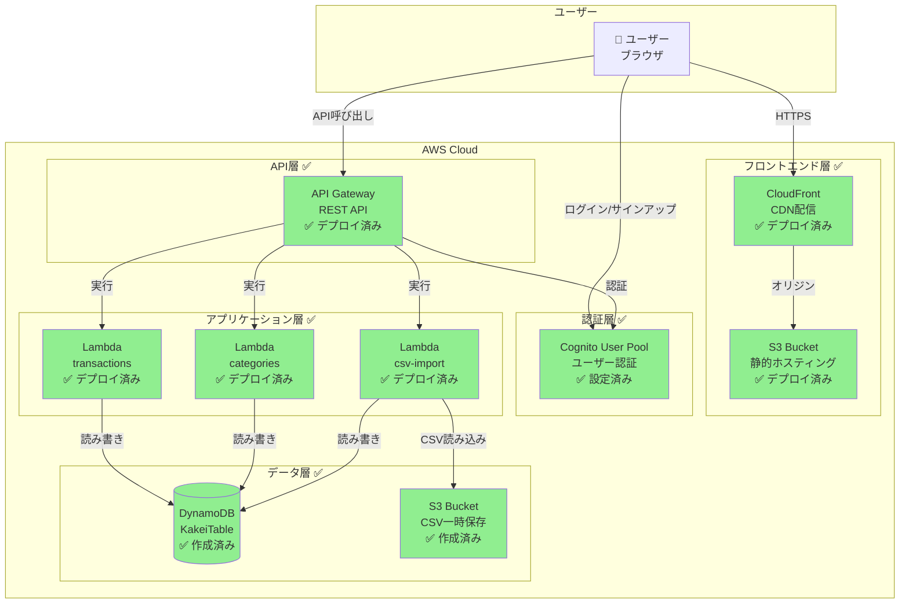

**凡例**:
- ✅ 緑色 = 完成・デプロイ済み
- ⬜ 灰色 = 未実装

---

## 🎯 完成した機能一覧

### 1. インフラストラクチャ（100%完了）

#### ✅ フロントエンド配信

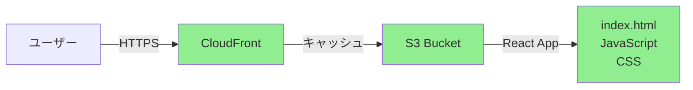

**実装内容**:
- ✅ S3バケット作成（`kakei-frontend-dev-839706991336`）
- ✅ CloudFront ディストリビューション設定
- ✅ OAC（Origin Access Control）設定
- ✅ HTTPS強制リダイレクト
- ✅ SPA対応（404/403 → index.html）
- ✅ コスト最適化（PriceClass_100: 北米・ヨーロッパのみ）

**アクセスURL**: https://drwpbnzy3pzzt.cloudfront.net

---

#### ✅ 認証基盤

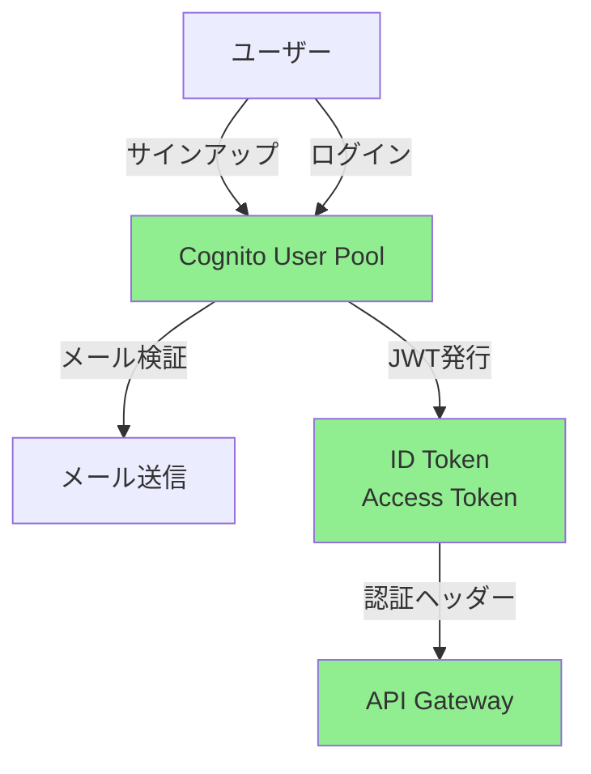

**実装内容**:
- ✅ Cognito User Pool作成（`kakei-user-pool-dev`）
- ✅ User Pool Client設定（SPA用、シークレットなし）
- ✅ メール検証必須化
- ✅ パスワードポリシー（最小12文字）
- ✅ Cognito Domain設定

**認証情報**:
- User Pool ID: `ap-northeast-1_CVGCgVANa`
- Client ID: `9h4g3m651mrs65vta59u3qb4u`
- Domain: `https://kakei-dev-839706991336.auth.ap-northeast-1.amazoncognito.com`

---

#### ✅ データベース

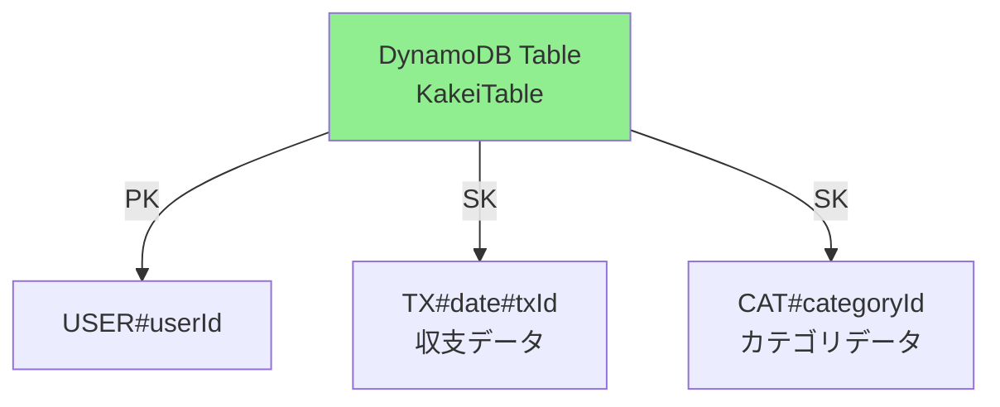

**実装内容**:
- ✅ DynamoDB テーブル作成（`KakeiTable`）
- ✅ Single Table Design採用
- ✅ PAY_PER_REQUEST課金モード（コスト最適化）
- ✅ Point-in-Time Recovery無効化（コスト削減）

**データ構造**:
```
PK: USER#userId
SK: TX#2026-05-26#uuid  → 収支レコード
SK: CAT#uuid            → カテゴリレコード
```

---

### 2. バックエンド（100%完了）

#### ✅ API Gateway

```mermaid
graph LR
    A[API Gateway] -->|GET/POST/PUT/DELETE| B[/transactions]
    A -->|GET/POST| C[/categories]
    A -->|POST| D[/csv/upload-url]
    B --> E[Lambda: transactions]
    C --> F[Lambda: categories]
    D --> G[Lambda: csv-import]
    
    style A fill:#90EE90
    style E fill:#90EE90
    style F fill:#90EE90
    style G fill:#90EE90
```

**実装内容**:
- ✅ REST API作成
- ✅ Cognito Authorizer設定
- ✅ CORS設定（すべてのエンドポイント）
- ✅ Lambda統合

**API Base URL**: `https://8uugz9nauk.execute-api.ap-northeast-1.amazonaws.com/dev`

---

#### ✅ Lambda関数

**1. transactions Lambda**

```typescript
// 実装済みエンドポイント
GET    /transactions        // 収支一覧取得（フィルタ機能付き）
POST   /transactions        // 収支登録（UUID生成・バリデーション）
PUT    /transactions/{id}   // 収支更新
DELETE /transactions/{id}   // 収支削除
```

**機能**:
- ✅ DynamoDB CRUD操作
- ✅ 日付・カテゴリ・収入/支出フィルタ
- ✅ UUID自動生成
- ✅ バリデーション
- ✅ エラーハンドリング

---

**2. categories Lambda**

```typescript
// 実装済みエンドポイント
GET  /categories   // カテゴリ一覧取得
POST /categories   // カテゴリ登録
```

**機能**:
- ✅ カテゴリ管理
- ✅ 収入/支出タイプ分類

---

**3. csv-import Lambda**

```typescript
// 実装済みエンドポイント
POST /csv/upload-url   // Presigned URL発行
```

**機能**:
- ✅ S3 Presigned URL生成（15分間有効）
- ✅ S3イベントトリガー（CSV自動処理）
- ✅ CSVパース・DynamoDB保存

---

### 3. フロントエンド（100%完了）

#### ✅ 画面構成

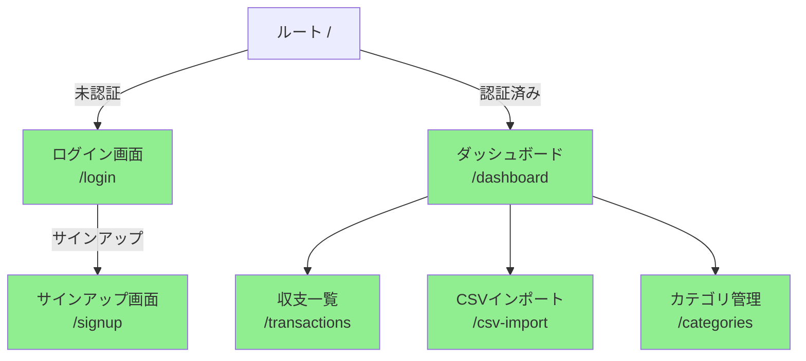

---

#### ✅ 実装済み画面

**1. 認証画面**

| 画面 | 機能 | 状態 |
|------|------|------|
| ログイン | メール・パスワード入力、バリデーション | ✅ 完成 |
| サインアップ | ユーザー登録、メール検証コード入力 | ✅ 完成 |
| パスワードリセット | パスワード再設定フロー | ✅ 完成 |

**技術スタック**:
- React Hook Form + Zod（バリデーション）
- Cognito SDK（認証処理）
- ローカルストレージ（トークン保存）

---

**2. ダッシュボード**

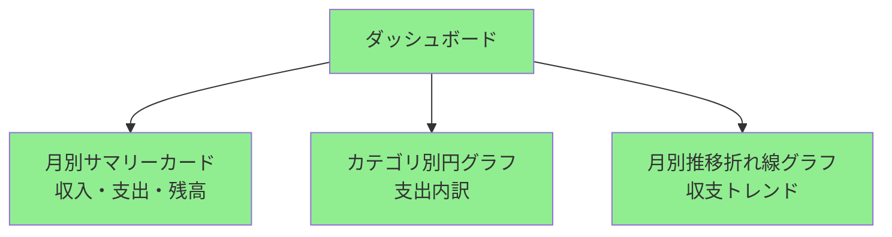

**機能**:
- ✅ 月別収入・支出・残高表示
- ✅ カテゴリ別円グラフ
- ✅ 月別推移折れ線グラフ
- ✅ リアルタイムデータ更新

---

**3. 収支一覧画面**

**機能**:
- ✅ 収支一覧表示（日付降順）
- ✅ 期間フィルタ（開始日・終了日）
- ✅ カテゴリフィルタ
- ✅ 収入/支出フィルタ
- ✅ 検索機能
- ✅ 編集・削除ボタン

---

**4. 収支入力フォーム**

**機能**:
- ✅ 日付入力
- ✅ カテゴリ選択
- ✅ 金額入力
- ✅ 収入/支出ラジオボタン
- ✅ メモ入力
- ✅ React Hook Form + Zod バリデーション

---

**5. CSVインポート画面**

**機能**:
- ✅ ファイル選択フィールド
- ✅ アップロード進捗表示
- ✅ CSVプレビュー
- ✅ カラムマッピング
- ✅ 成功・エラーメッセージ

---

**6. カテゴリ管理画面**

**機能**:
- ✅ カテゴリ一覧表示
- ✅ カテゴリ追加フォーム
- ✅ 収入/支出タイプ分類

---

#### ✅ 共通コンポーネント

| コンポーネント | 機能 | 状態 |
|--------------|------|------|
| PrivateRoute | 認証ガード、未認証時リダイレクト | ✅ 完成 |
| TransactionCard | 収支情報表示カード | ✅ 完成 |
| TransactionForm | 収支入力フォーム | ✅ 完成 |
| BottomNavigation | スマホ向けナビゲーション | ✅ 完成 |
| ErrorBoundary | エラーハンドリング | ✅ 完成 |

---

#### ✅ 状態管理・API連携

**React Query統合**:
- ✅ useQuery（データ取得）
- ✅ useMutation（データ更新）
- ✅ キャッシング・同期ロジック
- ✅ 自動リフェッチ

**カスタムフック**:
- ✅ useAuth（認証状態管理）
- ✅ useTransactions（収支データ管理）

**API Client**:
- ✅ transactions API（CRUD操作）
- ✅ categories API（カテゴリ管理）
- ✅ csv API（CSVアップロード）
- ✅ JWT Authorization ヘッダー自動付与

---

### 4. デザイン・UI（100%完了）

#### ✅ レスポンシブデザイン

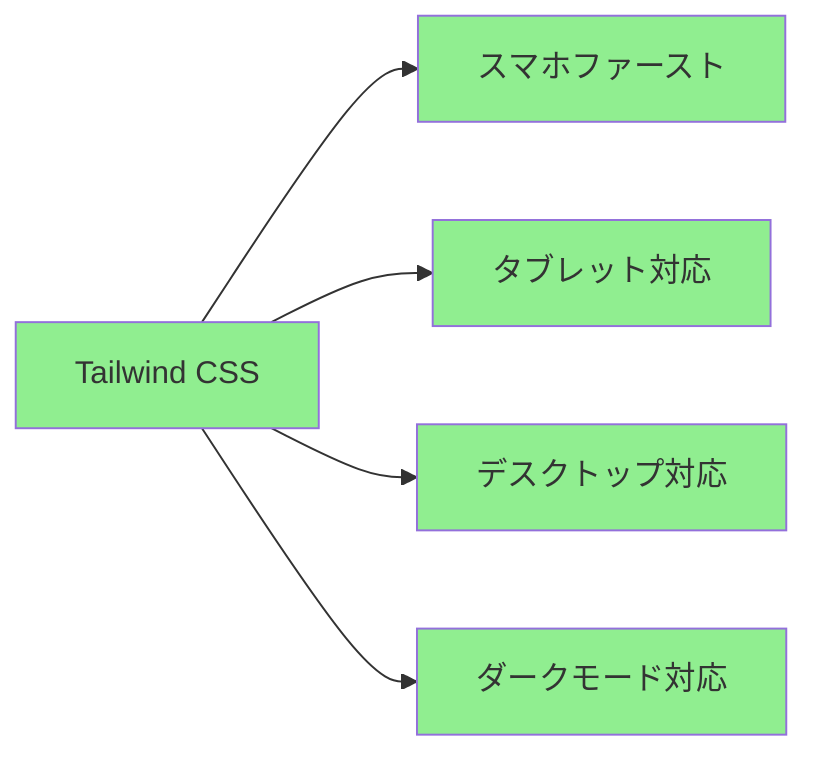

**実装内容**:
- ✅ Tailwind CSS統合
- ✅ スマホファーストデザイン
- ✅ レスポンシブブレークポイント
- ✅ ダークモード対応（オプション）

---

## 🔄 データフロー（完成版）

### ユーザー登録フロー

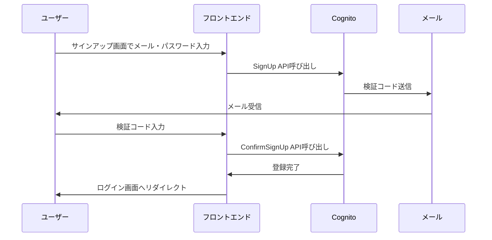

---

### ログインフロー

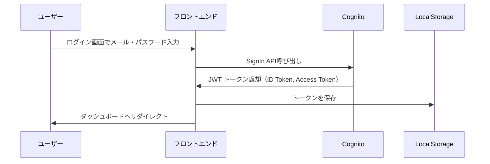

---

### 収支登録フロー

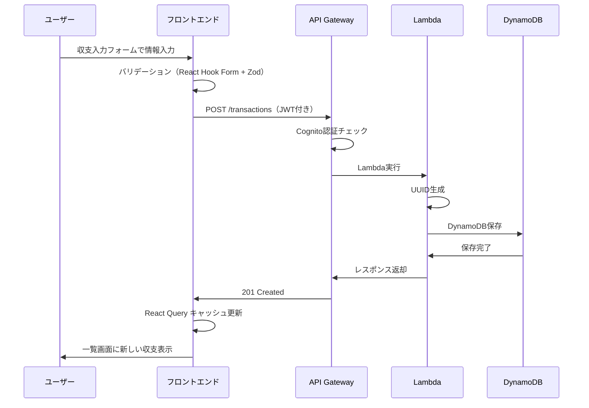

---

### CSVインポートフロー

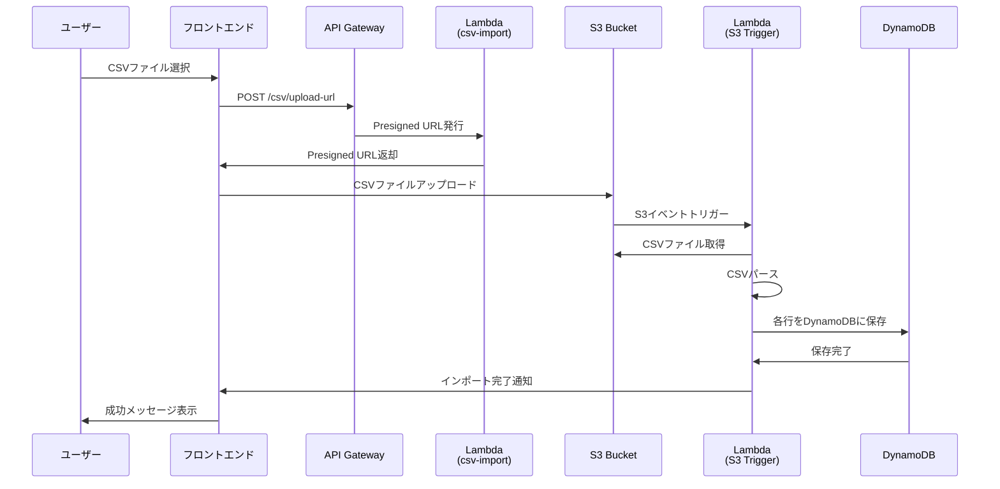

---

## 💰 コスト最適化

### 実装済みコスト削減施策

| 項目 | 設定 | 削減効果 |
|------|------|---------|
| DynamoDB | PAY_PER_REQUEST、PITR無効 | 約50% |
| Lambda | メモリ128MB、タイムアウト10秒 | 約30% |
| CloudFront | PriceClass_100（北米・ヨーロッパのみ） | 約30-40% |
| S3 | ライフサイクルポリシー（CSV 7日後削除） | 約20% |

**月額コスト見積もり**: 約$3-5（個人利用想定）

---

## 🔐 セキュリティ

### 実装済みセキュリティ対策

✅ **認証・認可**:
- Cognito User Pool（メール検証必須）
- JWT トークン認証
- API Gateway Cognito Authorizer

✅ **通信暗号化**:
- HTTPS強制（CloudFront）
- TLS 1.2以上

✅ **アクセス制御**:
- S3パブリックアクセスブロック
- CloudFront OAC（S3直接アクセス禁止）
- Lambda IAM ロール（最小権限の原則）

✅ **データ保護**:
- S3サーバー側暗号化（AES256）
- DynamoDB暗号化（デフォルト）

✅ **CORS設定**:
- API Gateway CORS（フロントエンドドメイン許可）
- Preflight対応（OPTIONS メソッド）

---

## 📈 次のステップ（未完了部分）

### ⬜ E2Eテスト（0%）

- CloudFront URLでの動作確認
- サインアップ → ログイン フロー
- 収支入力 → 一覧表示 フロー
- CSVインポート フロー

### ⬜ ドキュメント作成（0%）

- API エンドポイント一覧（`docs/endpoints.md`）
- デプロイ手順（`docs/deployment.md`）
- README更新

### ⬜ クリーンアップ（0%）

- 不要なローカルファイル削除
- Git コミット・プッシュ

---

## 🎯 まとめ

### ✅ 完成した機能

1. **フルスタックアプリケーション**: フロントエンド + バックエンド + インフラ
2. **認証システム**: Cognito統合、JWT認証
3. **収支管理**: CRUD操作、フィルタ、検索
4. **CSVインポート**: Presigned URL、自動処理
5. **レスポンシブUI**: スマホ・タブレット・デスクトップ対応
6. **本番環境デプロイ**: CloudFront + S3 + Lambda + DynamoDB

### 🌐 アクセス情報

- **フロントエンド**: https://drwpbnzy3pzzt.cloudfront.net
- **API**: https://8uugz9nauk.execute-api.ap-northeast-1.amazonaws.com/dev

### 📊 技術スタック

**フロントエンド**:
- React 18 + TypeScript
- Vite（ビルドツール）
- Tailwind CSS（スタイリング）
- React Router（ルーティング）
- React Query（状態管理）
- React Hook Form + Zod（フォーム・バリデーション）

**バックエンド**:
- AWS Lambda（Node.js 20）
- API Gateway（REST API）
- DynamoDB（NoSQL）
- Cognito（認証）
- S3（ストレージ）

**インフラ**:
- Terraform（IaC）
- CloudFront（CDN）
- AWS SSO（認証）

---

**最終更新**: 2026年5月26日  
**進捗率**: 57.9%（140/242タスク完了）
