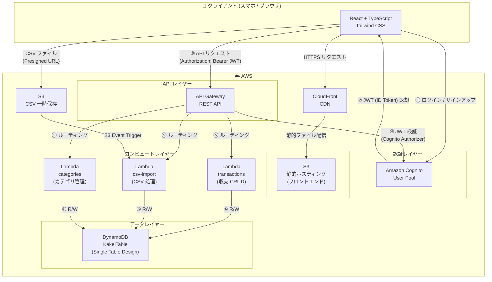

# システム設計書 — 家計管理アプリ

## 1. アプリ概要

| 項目 | 内容 |
|------|------|
| アプリ名 | KakeiApp（仮称） |
| コンセプト | スマホ最適化・格安運用の個人向け家計簿アプリ |
| 運用コスト目標 | AWS 無料枠を最大活用し、月額ほぼ $0 で運用 |
| ターゲット | 個人ユーザー（単一アカウント〜家族共有） |

---

## 2. 主要機能

### 2.1 収支入力
- 日付・カテゴリ・金額・メモを入力して収支を記録
- 収入 / 支出の区分選択
- カテゴリマスタ（食費・交通費・娯楽費など）

### 2.2 履歴表示
- 月別・カテゴリ別の一覧表示
- 収支サマリー（合計・残高）
- 期間フィルタリング・キーワード検索

### 2.3 CSV インポート
- 銀行・クレジットカードの明細 CSV をアップロード
- カラムマッピング機能で柔軟に取り込み
- 重複チェック機能

### 2.4 ユーザー認証
- Amazon Cognito による メール + パスワード認証
- JWT トークンベースの API 認可
- パスワードリセット・メール検証フロー

---

## 3. 技術スタック

### 3.1 Infrastructure as Code
| ツール | 用途 |
|--------|------|
| **Terraform** | AWS リソース全体のプロビジョニング・状態管理 |
| Terraform Cloud / S3 backend | tfstate の安全な保管 |

### 3.2 クラウド (AWS) — 無料枠重視構成

| サービス | 用途 | 無料枠 |
|----------|------|--------|
| **Amazon S3** | フロントエンド静的ホスティング・CSV 一時保存 | 5 GB ストレージ / 月 20,000 GET |
| **AWS Lambda** | API ビジネスロジック（Node.js 20.x） | 100 万リクエスト / 月、400,000 GB-s |
| **Amazon DynamoDB** | 収支データ・ユーザーデータ永続化 | 25 GB ストレージ、200 万 R/W |
| **Amazon API Gateway** | REST API エンドポイント管理 | 100 万呼び出し / 月（12 ヶ月） |
| **Amazon Cognito** | ユーザー認証・認可 | 50,000 MAU |
| **AWS CloudFront** | S3 コンテンツ CDN 配信 | 1 TB 転送 / 月（12 ヶ月） |
| **AWS IAM** | 最小権限ロール管理 | 無料 |

### 3.3 フロントエンド

| ツール | バージョン | 用途 |
|--------|-----------|------|
| **React** | 18.x | UI コンポーネント |
| **TypeScript** | 5.x | 型安全な開発 |
| **Tailwind CSS** | 3.x | ユーティリティファーストスタイリング |
| **Vite** | 5.x | 高速ビルドツール |
| **React Query** | 5.x | サーバーステート管理・キャッシュ |
| **React Hook Form** | 7.x | フォームバリデーション |
| **Zod** | 3.x | スキーマバリデーション |

### 3.4 バックエンド (Lambda)

| ツール | 用途 |
|--------|------|
| **Node.js 20.x (TypeScript)** | Lambda ランタイム |
| **AWS SDK v3** | AWS サービス操作 |
| **esbuild** | Lambda 用バンドル |

---

## 4. アーキテクチャ図

### 4.1 全体アーキテクチャ（リクエストフロー）



### 4.2 DynamoDB テーブル設計 (Single Table Design)

```mermaid
erDiagram
    KakeiTable {
        string PK "USER#userId"
        string SK "TX#yyyyMMdd#txId / CAT#categoryId"
        string type "TRANSACTION / CATEGORY"
        string date "yyyy-MM-dd"
        string category "カテゴリ名"
        number amount "金額"
        string incomeExpense "INCOME / EXPENSE"
        string memo "メモ"
        string createdAt "ISO8601"
        string updatedAt "ISO8601"
    }
```

### 4.3 API エンドポイント一覧

| Method | Path | Lambda | 説明 |
|--------|------|--------|------|
| GET | `/transactions` | transactions | 収支一覧取得（期間・カテゴリフィルタ） |
| POST | `/transactions` | transactions | 収支登録 |
| PUT | `/transactions/{id}` | transactions | 収支更新 |
| DELETE | `/transactions/{id}` | transactions | 収支削除 |
| GET | `/categories` | categories | カテゴリ一覧取得 |
| POST | `/categories` | categories | カテゴリ登録 |
| POST | `/csv/upload-url` | csv-import | Presigned URL 発行 |

---

## 5. セキュリティ設計

| 対策 | 内容 |
|------|------|
| 認証 | Cognito User Pool + JWT 検証 |
| 認可 | API Gateway Cognito Authorizer（全エンドポイント必須） |
| IAM | Lambda ロールは最小権限（DynamoDB 特定テーブルのみ） |
| 通信 | HTTPS 強制（CloudFront + API Gateway） |
| データ | DynamoDB 暗号化（AWS 管理キー） |
| CORS | API Gateway で許可オリジンを S3/CloudFront ドメインに限定 |

---

## 6. ディレクトリ構成（予定）

```
AI_Typescript_Terraform/
├── docs/                    # 設計ドキュメント
│   ├── system_design.md
│   └── todo.md
├── terraform/               # IaC (Terraform)
│   ├── main.tf
│   ├── variables.tf
│   ├── outputs.tf
│   └── modules/
│       ├── s3/
│       ├── lambda/
│       ├── dynamodb/
│       ├── api_gateway/
│       └── cognito/
├── backend/                 # Lambda 関数 (TypeScript)
│   ├── src/
│   │   ├── handlers/
│   │   │   ├── transactions.ts
│   │   │   ├── categories.ts
│   │   │   └── csv-import.ts
│   │   ├── lib/
│   │   │   ├── dynamo.ts
│   │   │   └── response.ts
│   │   └── types/
│   │       └── index.ts
│   ├── package.json
│   └── tsconfig.json
└── frontend/                # React アプリ (TypeScript)
    ├── src/
    │   ├── components/
    │   ├── pages/
    │   ├── hooks/
    │   ├── api/
    │   └── types/
    ├── package.json
    ├── tailwind.config.ts
    └── vite.config.ts